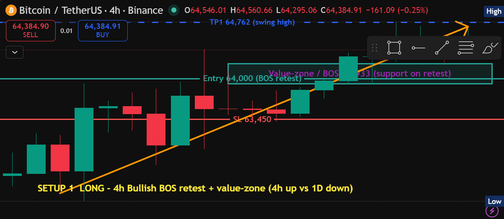
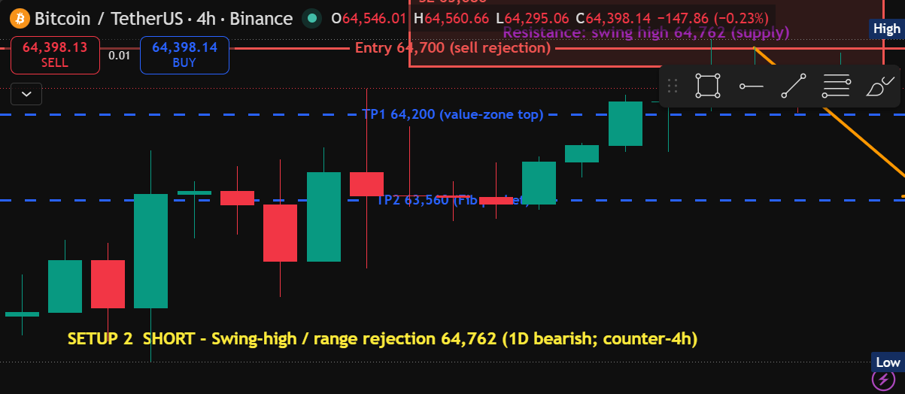
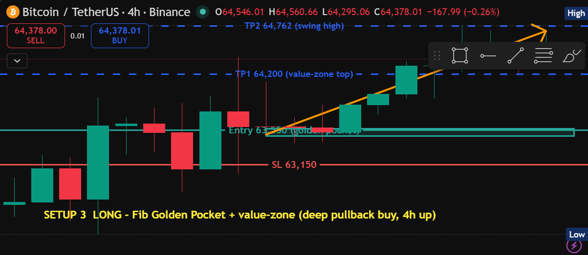
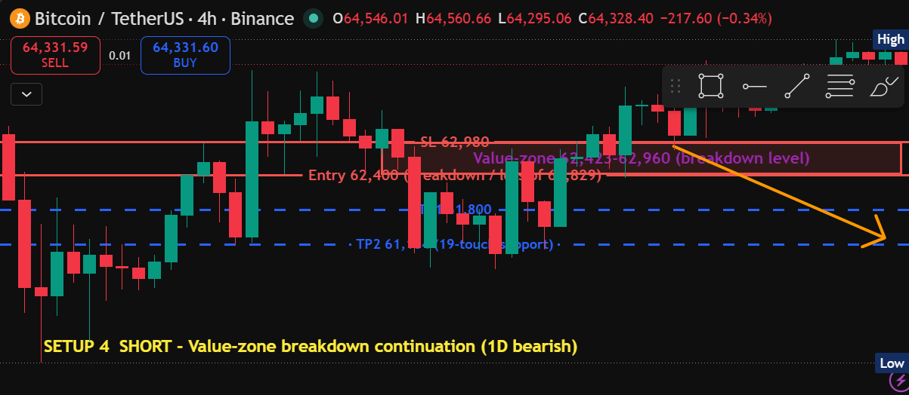
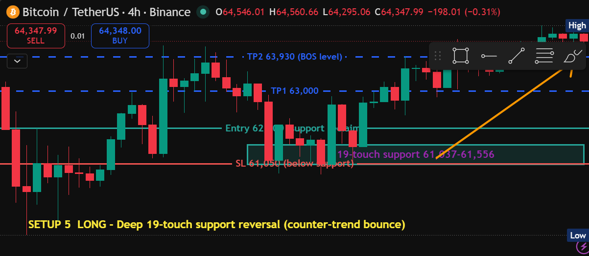

# BTCUSDT — Day-Trading Setup Documentation (4H execution)

**Generated:** 2026-06-14 13:20 UTC · **Chart:** BINANCE:BTCUSDT · **Timeframe:** 4H execution / 1D higher-timeframe bias (day-trading tier)
**Current price:** ~64,330 (live, drifting)

**Market context (detectors, read off the live chart's 4H/1D data):**
- **4H structure: bullish** — last confirmed bullish BOS at 63,933; price has recovered off a deep 60–62k washout and is pressing the 64,762 swing high.
- **1D structure: bearish** — the 4H rally is a relief bounce *inside* a higher-timeframe downtrend. This 4H-up / 1D-down tension is why both longs (HTF-counter, momentum) and shorts (HTF-aligned, at supply) are listed.
- **Swing high 64,762.77** (recent high / first upside target) · **value-zone 62,423–64,200** · **deep 19-touch support 61,037–61,556** · **bullish Fib Golden Pocket 63,487–63,568**.
- The chart's own 4H feed shows a deep wick to **59,130** ~40 bars back — real structure that frames the deep-support setups (4 & 5). No live SFP / RSI-divergence / CVD-divergence / pinbar trigger on the 4H window.

Annotation key: 🟥 Red = resistance / stop-loss · 🟩 Green = support / entry · 🟦 Blue = take-profit targets · 🟧 Orange = directional trend arrow. Each chart carries a yellow **setup callout** naming the play.

> Setups 1–3 are framed on the tight recent window (62,300–65,400); setups 4–5 are framed on the wider window so the deep 60–62k support structure is visible.

---

## Summary table

| # | Setup type | Dir | Entry | Stop | TP1 | TP2 | R:R (TP1 / TP2) | Prob. | Type |
|---|---|---|--:|--:|--:|--:|--:|:--:|:--:|
| 1 | 4H Bullish BOS retest + value-zone top | Long | 64,000 | 63,450 | 64,762 | 65,400 | 1.39 / 2.55 | **Medium** | Day (4H) |
| 2 | Swing-high / range rejection (64,762 supply) | Short | 64,700 | 65,080 | 64,200 | 63,560 | 1.32 / 3.00 | Medium | Day (4H) |
| 3 | Fib Golden Pocket + value-zone (deep pullback) | Long | 63,550 | 63,150 | 64,200 | 64,762 | 1.63 / 3.03 | **Medium-High** | Day (4H) |
| 4 | Value-zone breakdown continuation | Short | 62,400 | 62,980 | 61,800 | 61,184 | 1.03 / 2.10 | Low-Med | Day (4H) |
| 5 | Deep 19-touch support reversal | Long | 62,000 | 61,050 | 63,000 | 63,930 | 1.05 / 2.03 | Low | Day (4H) |

All five clear the bots' RR ≥ 1 floor. Close-based confirmation applies — wait for a **4H candle to close** at/through the trigger before committing.

---

## Setup 1 — LONG · 4H Bullish BOS retest + value-zone top · Probability: MEDIUM

Trend-aligned (4H) long: buy the pullback into the **broken-structure level 63,933 (BOS)** / top of the value zone, which should act as support on retest. Targets the swing high and a measured extension.

- **Symbol:** BTCUSDT · **Type:** Day (4H) · **Direction:** Long
- **Entry:** 64,000 (BOS retest) · **Stop:** 63,450 (below value zone)
- **TP1:** 64,762 (swing high) — **1.39 R** · **TP2:** 65,400 (extension) — **2.55 R**
- **Probability: Medium** — 4H-aligned, but pushing into the swing high against the 1D downtrend.

## Setup 2 — SHORT · Swing-high / range rejection (64,762 supply) · Probability: MEDIUM

HTF-aligned (1D bearish) fade: sell rejection at the **64,762 swing high / range-high supply**. This is the counter to the 4H uptrend, so it needs a clear rejection candle.

- **Symbol:** BTCUSDT · **Type:** Day (4H) · **Direction:** Short
- **Entry:** 64,700 (sell rejection) · **Stop:** 65,080 (above swing high)
- **TP1:** 64,200 (value-zone top) — **1.32 R** · **TP2:** 63,560 (Fib pocket) — **3.00 R**
- **Probability: Medium** — aligned with the 1D downtrend, but counter to 4H momentum.

## Setup 3 — LONG · Fib Golden Pocket + value-zone · Probability: MEDIUM-HIGH

The cleanest long: a deeper pullback into the **bullish Fib Golden Pocket (63,487–63,568)**, which overlaps value-zone support and is 4H-trend-aligned — multi-factor confluence with the tightest stop of the long setups.

- **Symbol:** BTCUSDT · **Type:** Day (4H) · **Direction:** Long
- **Entry:** 63,550 (golden pocket) · **Stop:** 63,150 (below the pocket)
- **TP1:** 64,200 (value-zone top) — **1.63 R** · **TP2:** 64,762 (swing high) — **3.03 R**
- **Probability: Medium-High** — confluence of Fib + value zone + 4H trend; best R of the longs.

## Setup 4 — SHORT · Value-zone breakdown continuation · Probability: LOW-MEDIUM

HTF-aligned continuation *if* the rally fails: a 4H close below the **62,423–62,960 value zone / loss of the 62,829 structure low** opens a move back toward the deep support. Anticipatory — price is well above this now.

- **Symbol:** BTCUSDT · **Type:** Day (4H) · **Direction:** Short
- **Entry:** 62,400 (breakdown / loss of 62,829) · **Stop:** 62,980 (back inside the zone)
- **TP1:** 61,800 — **1.03 R** · **TP2:** 61,184 (19-touch support) — **2.10 R**
- **Probability: Low-Medium** — 1D-aligned, but needs the breakdown to confirm; current price is far above.

## Setup 5 — LONG · Deep 19-touch support reversal · Probability: LOW

Lowest-conviction, counter-trend: *if* price flushes back to the **61,037–61,556 19-touch support** and reclaims, scalp the bounce toward the BOS level. Far from current price and against the 1D trend — a watch-and-wait.

- **Symbol:** BTCUSDT · **Type:** Day (4H) · **Direction:** Long (counter-trend)
- **Entry:** 62,000 (support reclaim) · **Stop:** 61,050 (below 19-touch support)
- **TP1:** 63,000 — **1.05 R** · **TP2:** 63,930 (BOS level) — **2.03 R**
- **Probability: Low** — counter to the 1D downtrend, deep and anticipatory.

---

### Notes
- **Directional read:** with 4H bullish but 1D bearish, the highest-quality plays are the **4H-aligned pullback longs (Setups 1 & 3)** while momentum holds, and the **1D-aligned supply short (Setup 2)** on a clean rejection of 64,762. Setups 4 & 5 are deeper, anticipatory levels for if the rally fails.
- Detectors used (day tier): SFP, Key Levels/Zones, Fibonacci, Market Structure (BOS/CHoCH), CVD Divergence, Pinbar, Chart Patterns — with **1D structure as the HTF bias filter**.
- Levels were read off the **live chart's own 4H/1D feed** (which diverged from the public mainnet-API scan — the chart is treated as source of truth).
- Each screenshot carries a single setup (drawings cleared between setups) so nothing overlaps; the yellow callout names each play.
- Screenshots + this summary live in `./screenshots/`.
