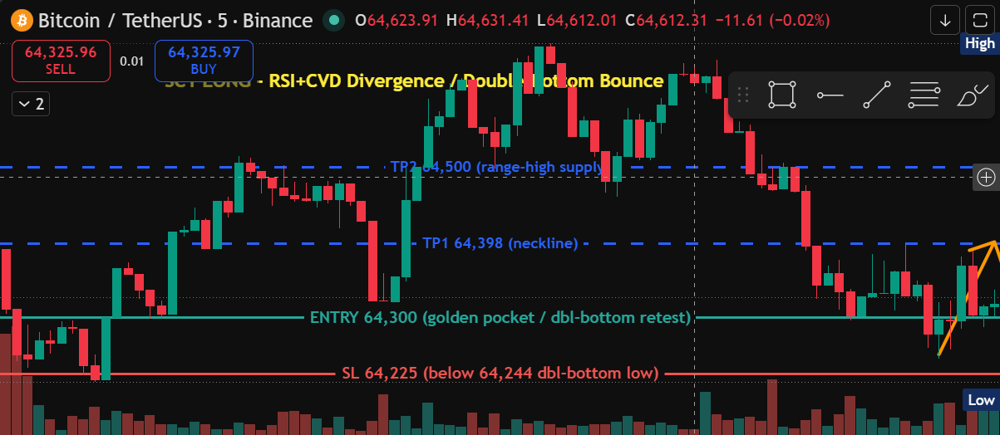
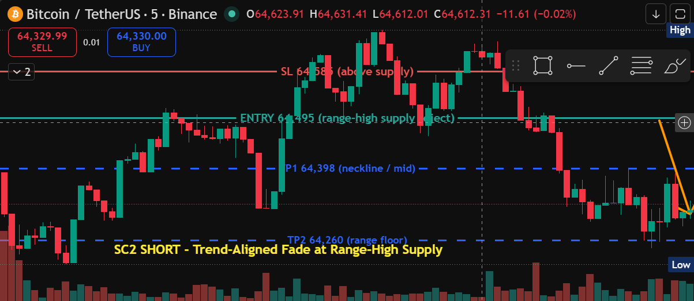

# BTCUSDT — Scalp-Trading Setup Documentation (5m execution)

**Generated:** 2026-06-14 14:03 UTC · **Chart:** BINANCE:BTCUSDT · **Timeframe:** 5m execution / 1H higher-timeframe bias (scalp tier)
**Current price:** ~64,325 (live, drifting)

**Market context (detectors, read off the live 5m / 1H chart):**
- **5m structure: bearish** — recent bearish BOS at 64,460 then 64,309; price is grinding lower inside a tight ~64,244–64,664 range.
- **1H structure: bearish** — HTF bias agrees (lower highs 64,710 → 64,664, lower low 64,214). Both timeframes down ⇒ the trend-aligned side is **short**.
- **Bullish confluence at the lows, though:** a **bullish RSI divergence** *and* **bullish CVD divergence** printed into the 64,295–64,309 area, plus a **double-bottom** (64,308 / 64,244, neckline 64,398) and a **bullish golden-pocket reaction** (64,293–64,299). That's a counter-trend mean-reversion bounce signal off the range floor.
- **Range map:** floor 64,244 (double-bottom low) · golden-pocket / value 64,293–64,309 · neckline / mid 64,398 · range-high supply 64,498–64,514 (heavy 27-touch / 18-touch zones) · session high 64,664. No live SFP or pinbar trigger.

This is a **range-bound 5m tape**, so the two scalps bracket the range: a **confluence bounce-long off the floor** (counter to the micro-trend but multi-signal) and a **trend-aligned fade-short at the range-high supply**. Both are mean-reversion plays back toward the 64,398 mid.

Annotation key: 🟥 Red = resistance / stop-loss · 🟩 Green = support / entry · 🟦 Blue = take-profit targets (dashed) · 🟧 Orange = directional trend arrow. Each chart carries a yellow **setup callout** naming the play.

> Both setups framed on the recent 5m window (last ~90 bars, ≈64,214–64,664). VPVR was hidden for these captures (restored after) so it didn't obscure the price action.

---

## Summary table

| # | Setup type | Dir | Entry | Stop | TP1 | TP2 | R:R (TP1 / TP2) | Prob. | Type |
|---|---|---|--:|--:|--:|--:|--:|:--:|:--:|
| 1 | RSI+CVD divergence / double-bottom bounce | Long | 64,300 | 64,225 | 64,398 | 64,500 | 1.31 / 2.67 | **Medium** | Scalp (5m) |
| 2 | Trend-aligned fade at range-high supply | Short | 64,495 | 64,585 | 64,398 | 64,260 | 1.08 / 2.61 | **Medium-High** | Scalp (5m) |

Both clear the bots' RR ≥ 1 floor. Close-based confirmation applies — wait for a **5m candle to close** at/through the trigger before committing (scalp = fast; manage actively).

> **Invalidation vs. stop:** the **stop** is the price-based exit; the **invalidation** is the structural condition that voids the *thesis* — a **5m close** beyond a key level, not just a wick. Each setup also has a **pre-entry** condition under which it never arms and shouldn't be chased.

| # | Dir | Invalidation (close-based) |
|---|:--:|---|
| 1 | Long | 5m close **below 64,244** (double-bottom low fails → divergence negated, range breaks down) |
| 2 | Short | 5m close **above 64,585** (reclaims range-high supply → range breakout, fade is wrong) |

---

## Setup 1 — LONG · RSI+CVD divergence / double-bottom bounce · Probability: MEDIUM

Counter-trend mean-reversion long with the most confluence on the tape: **bullish RSI divergence + bullish CVD divergence + double-bottom (64,244/64,308) + golden-pocket reaction**. Buy the retest of the pocket / double-bottom and scalp the bounce back to the mid and range-high.

- **Symbol:** BTCUSDT · **Type:** Scalp (5m) · **Direction:** Long (counter-trend)
- **Entry:** 64,300 (golden pocket / double-bottom retest) · **Stop:** 64,225 (below the 64,244 double-bottom low) — risk 75
- **TP1:** 64,398 (neckline) — **1.31 R** · **TP2:** 64,500 (range-high supply) — **2.67 R**
- **Probability: Medium** — strong confluence cluster, but fights both the 5m and 1H downtrends; take TP1 quickly and trail.
- **Invalidation:** a **5m close below 64,244** breaks the double-bottom low and negates the divergence — the floor is gone, expect range-down continuation. Pre-entry: voided if price rips straight through 64,398 without offering the 64,300 retest (don't chase). Stop 64,225 sits just under the invalidation level.

## Setup 2 — SHORT · Trend-aligned fade at range-high supply · Probability: MEDIUM-HIGH

The trend-aligned scalp (both 5m and 1H bearish): sell a rally into the **64,498–64,514 range-high supply** (27-/18-touch zones) and fade back toward the mid and range floor. Anticipatory — price is mid-range now; needs the push into supply + a rejection candle.

- **Symbol:** BTCUSDT · **Type:** Scalp (5m) · **Direction:** Short
- **Entry:** 64,495 (range-high supply reject) · **Stop:** 64,585 (above the supply zone) — risk 90
- **TP1:** 64,398 (neckline / mid) — **1.08 R** · **TP2:** 64,260 (range floor) — **2.61 R**
- **Probability: Medium-High** — aligned with both timeframes and selling into a heavily-tested supply; best directional odds of the pair.
- **Invalidation:** a **5m close above 64,585** reclaims the range-high supply and signals a range breakout — the fade is wrong, stand aside / flip bias. Pre-entry: voided if price rolls over without ever tagging the 64,495–64,514 supply (no rejection to sell). Stop 64,585 = the invalidation level.

---

### Notes
- **Directional read:** trend (5m + 1H) favors **Setup 2 (short)**; the floor confluence favors **Setup 1 (long)**. In practice this is a **range scalp** — long the 64,244–64,300 floor, short the 64,495–64,514 ceiling, both targeting the 64,398 mid. Whichever level breaks on a 5m close (64,244 down or 64,585 up) ends the range and the corresponding setup.
- Detectors used (scalp tier): RSI/CVD Divergence, Market Structure (BOS/CHoCH), Key Levels/Zones, Chart Patterns (double-top/bottom), Fibonacci, SFP, Pinbar — with **1H structure as the HTF bias filter**.
- Levels read off the **live chart's own 5m/1H feed**, cross-checked against the public mainnet-API scan.
- Each screenshot carries a single setup (drawings cleared between setups). **VPVR was hidden** for these captures to keep the price action readable, then restored.
- Screenshots + this summary live in `./screenshots/`.
