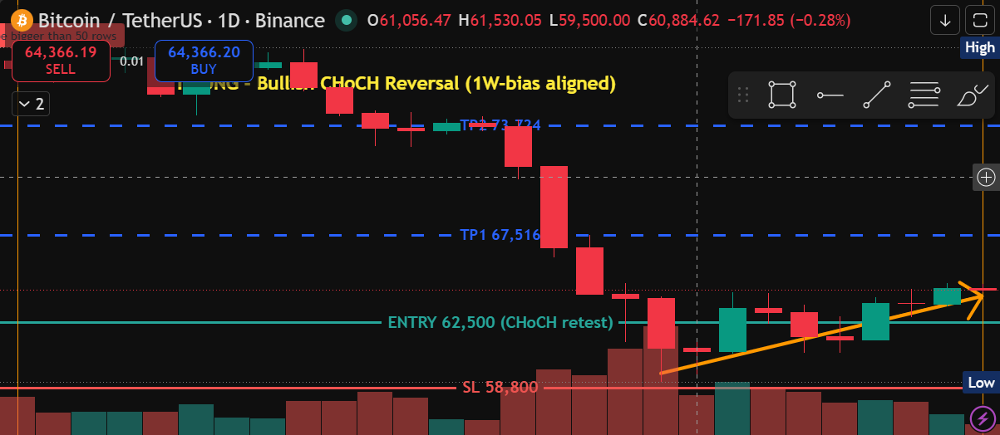
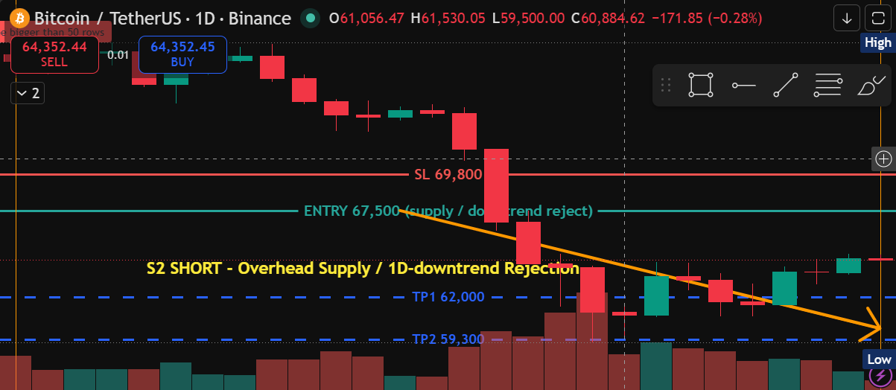
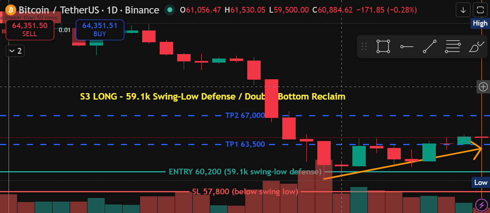
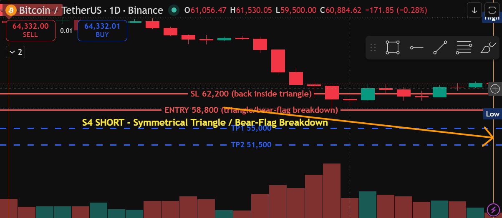
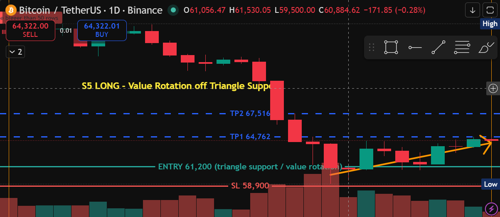

# BTCUSDT — Swing-Trading Setup Documentation (1D execution)

**Generated:** 2026-06-14 13:53 UTC · **Chart:** BINANCE:BTCUSDT · **Timeframe:** 1D execution / 1W higher-timeframe bias (swing-trading tier)
**Current price:** ~64,300 (live, drifting)

**Market context (detectors, read off the live 1D / 1W chart):**
- **1D structure: bearish** — confirmed bearish BOS at 76,051 then 74,290; price sold off from the 82–83k double-top region down to a deep 59,131 flush.
- **Recent bullish CHoCH at 64,235** — the first sign the daily downtrend may be stalling; price has reclaimed off the 59,131 low and is basing in the low-60ks. This 1D-bearish / fresh-CHoCH tension is why both reversal longs and continuation shorts are listed.
- **1W structure: bullish** — the weekly trend is still up, so the 1D washout reads as a deep pullback inside a higher-timeframe uptrend. This favors the reclaim/defense **longs (Setups 1, 3, 5)** as the higher-probability side; the **shorts (2, 4)** are 1D-trend-aligned fades/continuations that need confirmation.
- **Key structure:** symmetrical triangle (upper 78,080 → 64,235, lower 59,131 → 60,755) · bear-flag breakout ref 60,746 (stop 64,762) · double-tops at 78–82k · 5-touch supply zone 76,051–78,200 · deep swing low **59,131** · golden-pocket reaction ~62.9–63.0k.
- No live SFP / RSI-divergence / CVD-divergence / pinbar trigger on the 1D window — these setups are structure-, level-, and pattern-driven.

Annotation key: 🟥 Red = resistance / stop-loss · 🟩 Green = support / entry · 🟦 Blue = take-profit targets (dashed) · 🟧 Orange = directional trend arrow. Each chart carries a yellow **setup callout** naming the play.

> All setups framed on the recent daily window (bars ~272–299, ≈59,100–78,200). Breakdown targets for Setup 4 are projections below the visible data, shown via expanded bottom margin.

---

## Summary table

| # | Setup type | Dir | Entry | Stop | TP1 | TP2 | R:R (TP1 / TP2) | Prob. | Type |
|---|---|---|--:|--:|--:|--:|--:|:--:|:--:|
| 1 | Bullish CHoCH swing reversal (1W-aligned) | Long | 62,500 | 58,800 | 67,516 | 73,724 | 1.36 / 3.03 | **Medium-High** | Swing (1D) |
| 2 | Overhead supply / 1D-downtrend rejection | Short | 67,500 | 69,800 | 62,000 | 59,300 | 2.39 / 3.57 | Medium | Swing (1D) |
| 3 | 59.1k swing-low defense / double-bottom reclaim | Long | 60,200 | 57,800 | 63,500 | 67,000 | 1.38 / 2.83 | **Medium** | Swing (1D) |
| 4 | Symmetrical-triangle / bear-flag breakdown | Short | 58,800 | 62,200 | 55,000 | 51,500 | 1.12 / 2.15 | Low-Med | Swing (1D) |
| 5 | Value rotation off triangle support | Long | 61,200 | 58,900 | 64,762 | 67,516 | 1.55 / 2.75 | **Medium** | Swing (1D) |

All five clear the bots' RR ≥ 1 floor. Close-based confirmation applies — wait for a **daily candle to close** at/through the trigger before committing.

> **Invalidation vs. stop:** the **stop** is the price-based exit (where the trade is closed); the **invalidation** is the structural condition that voids the *thesis* — almost always a **daily close** beyond a key level, not just an intrabar wick. Where the two coincide they're noted together. Each setup also has a **pre-entry** invalidation: the condition under which the entry never arms and the setup should not be chased.

| # | Dir | Invalidation (close-based) |
|---|:--:|---|
| 1 | Long | Daily close **below 59,131** (negates CHoCH, re-confirms bearish BOS) |
| 2 | Short | Daily close **above 69,800** (reclaims supply / ~69,310 neckline, flips structure bullish) |
| 3 | Long | Daily close **below 59,131** (low fails, no double-bottom) |
| 4 | Short | Daily close back **above 62,200** (failed breakdown / bear-trap); also never arms unless price first closes below ~59,131 |
| 5 | Long | Daily close **below 58,900** (loss of triangle/value support) |

---

## Setup 1 — LONG · Bullish CHoCH swing reversal · Probability: MEDIUM-HIGH

The primary swing long and the only setup aligned with **both** the fresh 1D bullish CHoCH (64,235) **and** the 1W uptrend. Buy a pullback into the low-60ks after the change-of-character, targeting the broken-structure levels back up the range.

- **Symbol:** BTCUSDT · **Type:** Swing (1D) · **Direction:** Long
- **Entry:** 62,500 (CHoCH retest / value) · **Stop:** 58,800 (below the 59,131 swing low) — risk 3,700
- **TP1:** 67,516 (prior structure) — **1.36 R** · **TP2:** 73,724 (double-top neckline) — **3.03 R**
- **Probability: Medium-High** — 1W-bullish-aligned with a confirmed 1D CHoCH; deepest stop of the longs but the cleanest thesis.
- **Invalidation:** a **daily close below 59,131** (the swing low) negates the bullish CHoCH and re-confirms the bearish BOS with a fresh lower low — thesis dead. Pre-entry: also voided if price breaks down through 59,131 before tagging the 62,500 retest (no setup, don't chase). Stop 58,800 sits just under the invalidation level.

## Setup 2 — SHORT · Overhead supply / 1D-downtrend rejection · Probability: MEDIUM

1D-trend-aligned fade: if the bounce rallies into **67–68k overhead supply** without reclaiming structure, sell the rejection back toward the lows. Anticipatory — price is below this now; needs a clear rejection candle.

- **Symbol:** BTCUSDT · **Type:** Swing (1D) · **Direction:** Short
- **Entry:** 67,500 (supply / downtrend reject) · **Stop:** 69,800 (above supply) — risk 2,300
- **TP1:** 62,000 (range mid) — **2.39 R** · **TP2:** 59,300 (retest of the 59.1k low) — **3.57 R**
- **Probability: Medium** — best R:R on the board and 1D-aligned, but fights the fresh bullish CHoCH and the 1W uptrend.
- **Invalidation:** a **daily close above 69,800** (reclaim of the supply zone / above the ~69,310 H&S neckline) confirms CHoCH follow-through and flips the 1D structure bullish — the fade is wrong. Pre-entry: voided if price reverses lower without ever reaching the 67–68k supply (no rejection to sell). Stop 69,800 = the invalidation level.

## Setup 3 — LONG · 59.1k swing-low defense / double-bottom reclaim · Probability: MEDIUM

Buy-the-dip: if price retests and holds the **59,131 swing low** (double-bottom), enter the reclaim toward the range mid. Tighter stop than Setup 1, same bullish 1W context.

- **Symbol:** BTCUSDT · **Type:** Swing (1D) · **Direction:** Long
- **Entry:** 60,200 (swing-low defense) · **Stop:** 57,800 (below the low) — risk 2,400
- **TP1:** 63,500 (value) — **1.38 R** · **TP2:** 67,000 (overhead supply) — **2.83 R**
- **Probability: Medium** — structurally clean reclaim aligned with the 1W uptrend; needs the 59.1k low to hold.
- **Invalidation:** a **daily close below 59,131** breaks the low and kills the double-bottom — no higher low, no reclaim. (This is the hand-off point to Setup 4's breakdown short.) Stop 57,800 gives the wick room below the broken level.

## Setup 4 — SHORT · Symmetrical-triangle / bear-flag breakdown · Probability: LOW-MEDIUM

Continuation short *if the base fails*: a daily close below the **triangle support / 59,131 low** (bear-flag breakout ref 60,746) opens the measured move toward the low-50ks. Highest-target play but counter to the 1W trend — confirmation-dependent.

- **Symbol:** BTCUSDT · **Type:** Swing (1D) · **Direction:** Short
- **Entry:** 58,800 (breakdown of support) · **Stop:** 62,200 (back inside the triangle) — risk 3,400
- **TP1:** 55,000 — **1.12 R** · **TP2:** 51,500 (measured move) — **2.15 R**
- **Probability: Low-Medium** — 1D-pattern-aligned but counter to the 1W uptrend; only valid on a confirmed breakdown close.
- **Invalidation:** a **daily close back above 62,200** (recovery inside the triangle) marks a failed breakdown / bear-trap — thesis void. Pre-entry: this setup only *arms* on a confirmed daily close below ~59,131; if price holds the base instead and rotates up, the breakdown never triggers (defer to Setups 3/5). Stop 62,200 = the invalidation level.

## Setup 5 — LONG · Value rotation off triangle support · Probability: MEDIUM

Range-trade long: with price basing inside the triangle, buy the rotation off the **lower-triangle / value support (≈61k)** back toward the prior swing high. Tightest stop of the longs; tradeable while the base holds.

- **Symbol:** BTCUSDT · **Type:** Swing (1D) · **Direction:** Long
- **Entry:** 61,200 (triangle support / value) · **Stop:** 58,900 (below support) — risk 2,300
- **TP1:** 64,762 (swing high) — **1.55 R** · **TP2:** 67,516 (overhead supply) — **2.75 R**
- **Probability: Medium** — 1W-aligned value rotation with good R:R; caps at supply rather than running the full range.
- **Invalidation:** a **daily close below 58,900** (loss of lower-triangle / value support) ends the range-rotation thesis and tips into the breakdown scenario (Setup 4). Stop 58,900 = the invalidation level.

---

### Notes
- **Directional read:** the 1W uptrend over a deep 1D pullback + fresh bullish CHoCH favors the **reclaim/defense longs (Setups 1, 3, 5)** as the higher-probability side. The **shorts (2, 4)** are 1D-trend-aligned fades/continuations — Setup 2 on a clean rejection of 67–68k supply, Setup 4 only on a confirmed breakdown of the 59.1k base.
- Detectors used (swing tier): Market Structure (BOS/CHoCH), Key Levels/Zones, Chart Patterns (triangle, bear-flag, double-top/bottom, H&S), Fibonacci, SFP, RSI/CVD Divergence, Pinbar — with **1W structure as the HTF bias filter**.
- Levels were read off the **live chart's own 1D/1W feed** (treated as source of truth) cross-checked against the public mainnet-API scan.
- Each screenshot carries a single setup (drawings cleared between setups) so nothing overlaps; the yellow callout names each play.
- Screenshots + this summary live in `./screenshots/`.
